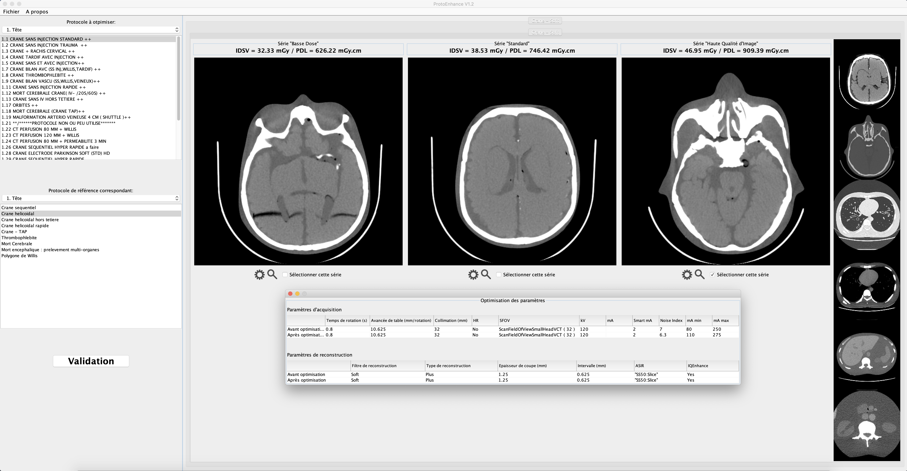

# ProtoEnhance

 

## General purpose
To optimize and follow-up CT protocol acquisition settings for GE machines.
New GE Revolution CT scanners (with new GUI) are not currently supported.

## CT system requirement
This code has been tested on VCT, 750HD and RevoGSI systems. But, I expect all GE CT units with protocol file system with `VersionName = "3.5.1"` will work with ProtoEnhance.
A CT system state save has been included in this repo to have a "user" protocol database for testing purpose. `service_mod_data.7z` file have to be decompressed (see CT images sample section to have clue for decompress tool).
You have to create your own system state to operate ProtoEnhance on your own CT protocols.

## OS platform

This code has been developed in Java language on Windows Seven platform (more precisely in Eclipse IDE).
**But**, all the functions are normally other OS platform proof. 

## Software configuration

It extremely recommended to follow the software procedure included in the archive. First you have to decompress the CT images database in DICOM format to operate the software (see the section below).

## CT images sample

A compressed CT images sample folder for brain localization have been included in this repo for testing purpose. It is placed in `Images` folder. You have to decompress it. To do so, you have to decompress the 7-zip archive with additional software such as [7-zip](https://www.7-zip.org) on Windows or [Keka](https://www.keka.io/en/) on macOS.

The whole CT images database is available at this [link](https://drive.google.com/file/d/1gHHRTv2LkE8c3-3aNpRTc2L9JnsLl4Ud/view?usp=sharing)

## Protocols database sample

As already describe in CT system requirement section, a protocol database is available in this repo called `service_mod_data.7z`. To activate it, you just have to decompress it.

## Software language

**This software is only available in French for the moment**. 

-----

Have a nice utilization.

## Authors

[François Gardavaud](https://fgardavaud.github.io/), Hugo Pasquier for software designing and development and Pr Alain Luciani, Pr Alain Rahmouni for image quality medical validation

## [Return to homepage](https://fgardavaud.github.io/)

